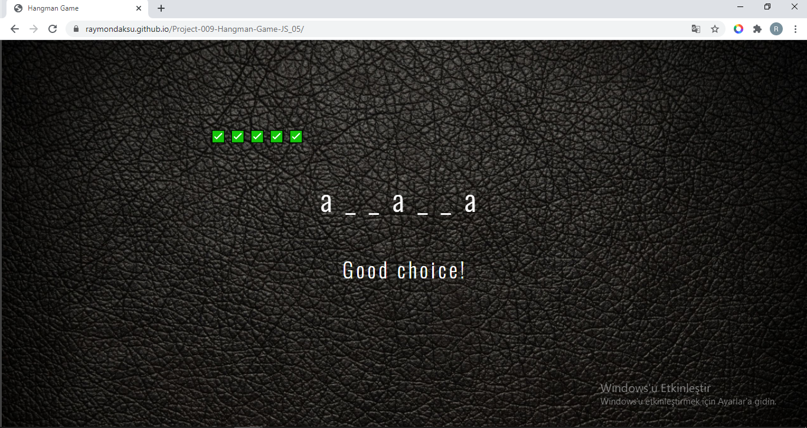
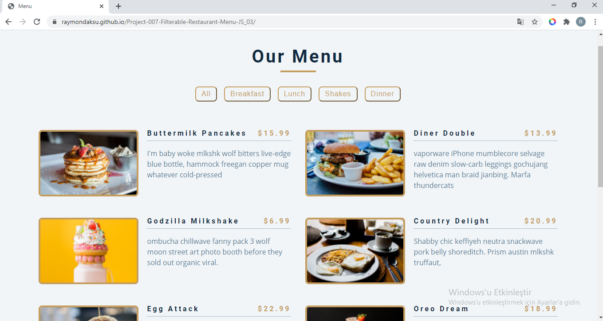

 
    &nbsp;&nbsp;
    &nbsp;&nbsp;
    &nbsp;&nbsp;
    <h1 align="center">Index of HTML & CSS & JS Projects</h1>

 
 

### Projects

- **Hangman Game (HTML, CSS-Responsive, JS)**  [Repository](https://github.com/raymondaksu/Project-009-Hangman-Game-JS_05) - 
  [Live demo](https://raymondaksu.github.io/Project-009-Hangman-Game-JS_05/) 
      
- **Filterable Restaurant Menu (HTML, CSS-Responsive, JS)**  [Repository](https://github.com/raymondaksu/Project-007-Filterable-Restaurant-Menu-JS_03) - 
  [Live demo](https://raymondaksu.github.io/Project-007-Filterable-Restaurant-Menu-JS_03/) 
      
