
 
    &nbsp;&nbsp;
    &nbsp;&nbsp;
    &nbsp;&nbsp;
    <h1 align="center">Index of HTML & CSS & JS Projects</h1>

 
 

### Projects

- **Filterable Restaurant Menu (HTML, CSS-Responsive, JS)**  [Repository](https://github.com/raymondaksu/Project-007-Filterable-Restaurant-Menu-JS_03) - 
  [Live demo](https://raymondaksu.github.io/Project-007-Filterable-Restaurant-Menu-JS_03/) 
      
- **Website Page Design(HTML, SASS-Responsive, JS)**  [Repository](https://github.com/raymondaksu/Project-004-Website-Page-Design-HTML-CSS_04) - 
  [Live demo](https://raymondaksu.github.io/Project-004-Website-Page-Design-HTML-CSS_04/) 
  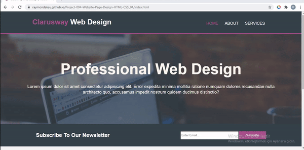    
- **Hangman Game (HTML, CSS-Responsive, JS)**  [Repository](https://github.com/raymondaksu/Project-009-Hangman-Game-JS_05) - 
  [Live demo](https://raymondaksu.github.io/Project-009-Hangman-Game-JS_05/) 
      
- **ToDo List (HTML, CSS-Responsive, JS)**  [Repository](https://github.com/raymondaksu/Project-008-To-Do-List-JS_04) - 
  [Live demo](https://raymondaksu.github.io/Project-008-To-Do-List-JS_04/) 
  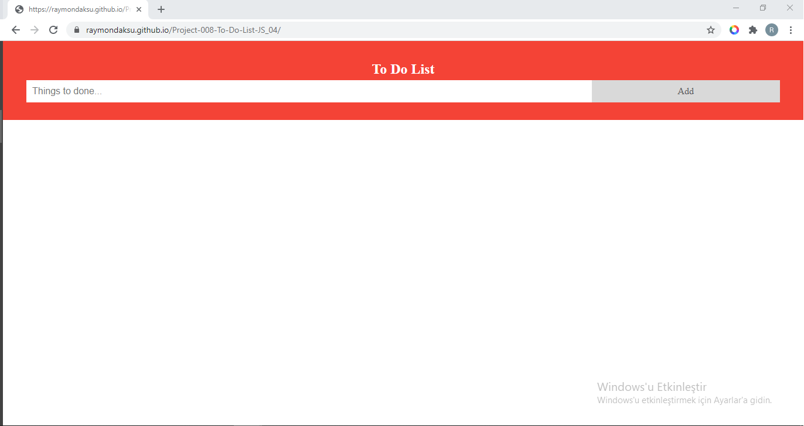    
- **Calculator (HTML, CSS, JS)**  [Repository](https://github.com/raymondaksu/Project-006-Calculator-JS_02) - 
  [Live demo](https://raymondaksu.github.io/Project-006-Calculator-JS_02/) 
  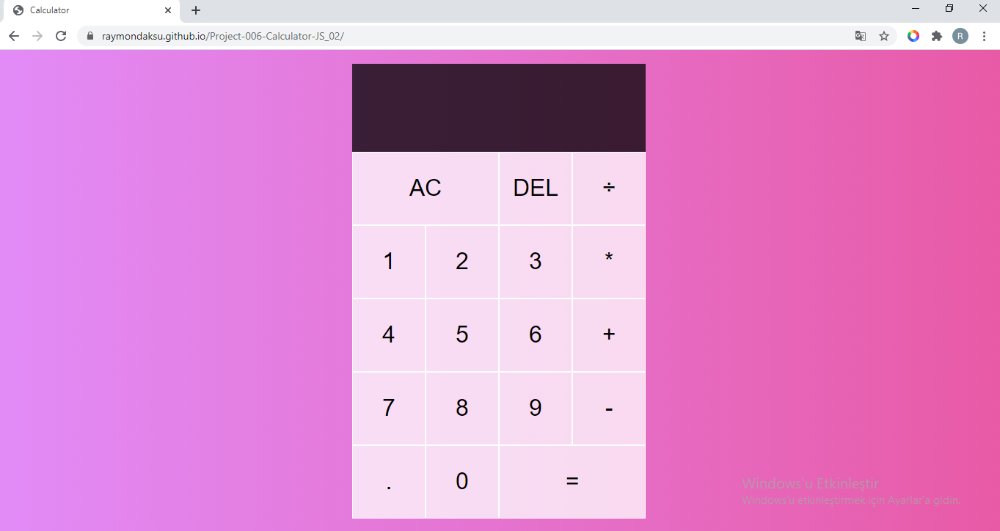    
- **Find the Number Game(HTML, CSS-Responsive, JS)**  [Repository](https://github.com/raymondaksu/Project-005-Find-The-Number-JS_01) - 
  [Live demo](https://raymondaksu.github.io/Project-005-Find-The-Number-JS_01/) 
  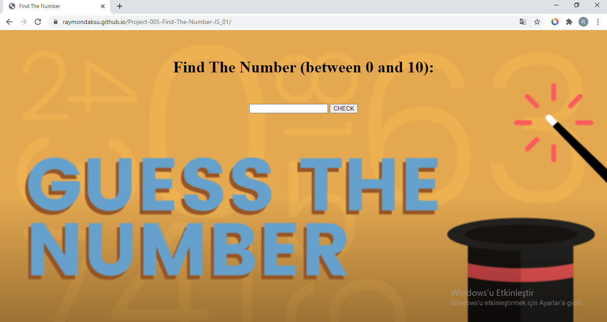    
- **Roman Number Conversion(HTML, CSS-Responsive, JS)**  [Repository](https://github.com/raymondaksu/Coding-Challenges/tree/master/js-cc-06) - 
  [Live demo](https://raymondaksu.github.io/Coding-Challenges/js-cc-06/) 
  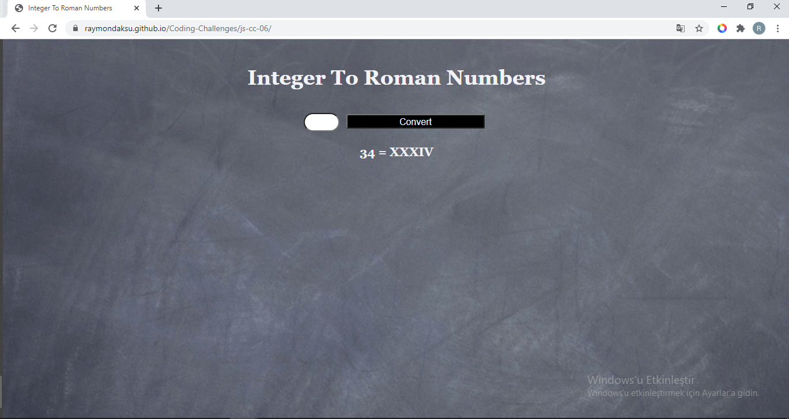    
- **Arrays Merge (HTML, CSS, JS)**  [Repository](https://github.com/raymondaksu/Coding-Challenges/tree/master/js-cc-04) - 
  [Live demo](https://raymondaksu.github.io/Coding-Challenges/js-cc-04/) 
  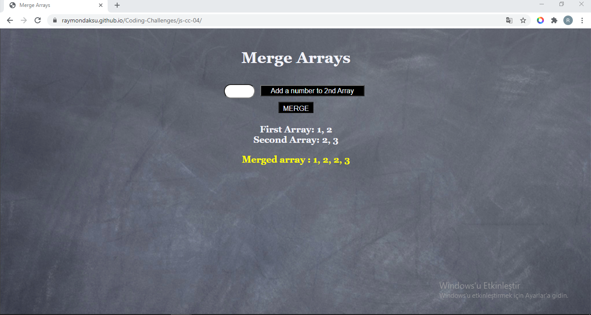    
- **Find the Fibonacci Number (HTML, CSS, JS)**  [Repository](https://github.com/raymondaksu/Coding-Challenges/tree/master/js-cc-01) - 
  [Live demo](https://raymondaksu.github.io/Coding-Challenges/js-cc-01/) 
  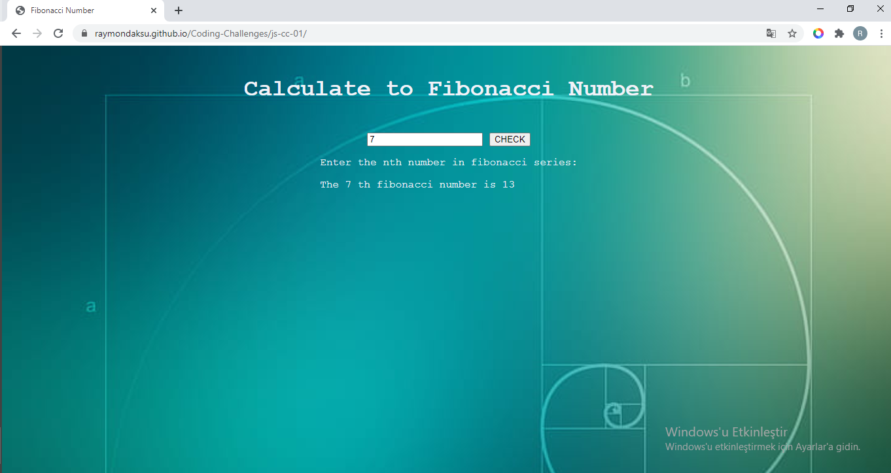    
- **Visual Clock (HTML, CSS, JS)**  [Repository](https://github.com/raymondaksu/Sprint-2_Visual_Clock) - 
  [Live demo](https://raymondaksu.github.io/Sprint-2_Visual_Clock/) 
  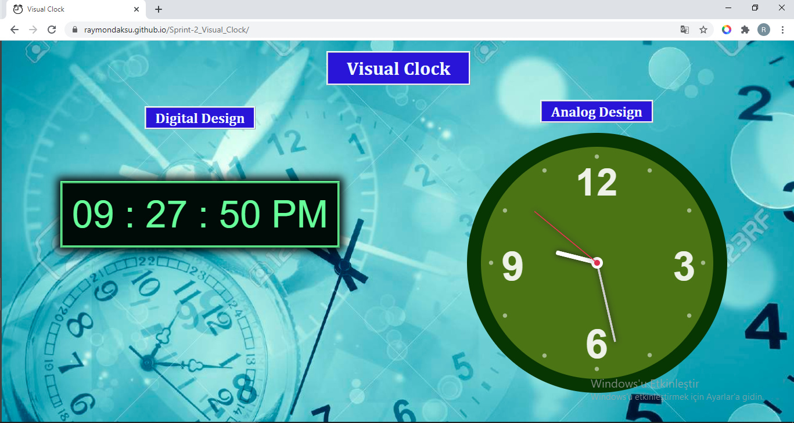    
- **Team Page (HTML, CSS-Responsive)**  [Repository](https://github.com/raymondaksu/Sprint-1_Team_Page_Creating) - 
  [Live demo](https://raymondaksu.github.io/Sprint-1_Team_Page_Creating/) 
  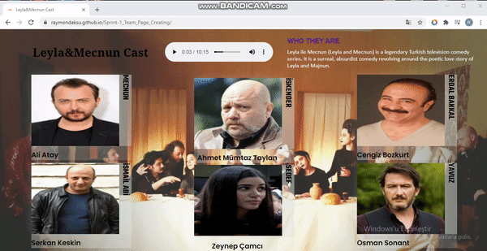    
- **Checkout Form (HTML, CSS)**  [Repository](https://github.com/raymondaksu/Coding-Challenges/tree/master/cc-003) - 
  [Live demo](https://raymondaksu.github.io/Coding-Challenges/cc-003/) 
  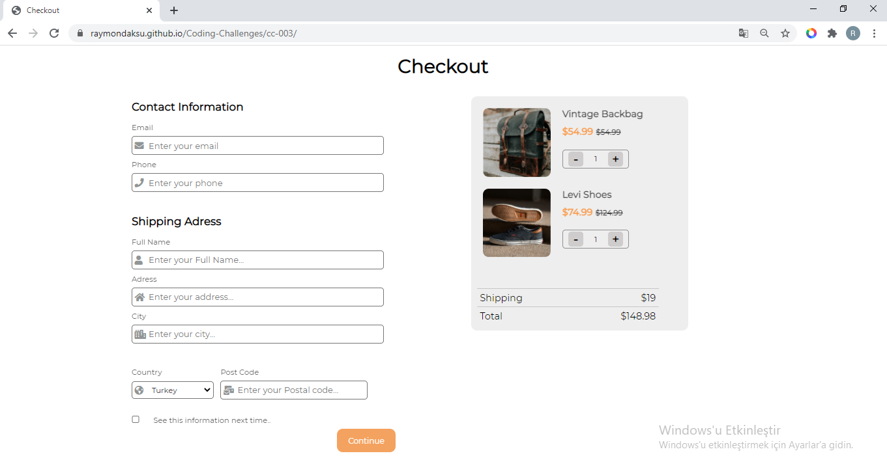    
- **Parallax Website (HTML, SASS-Responsive)**  [Repository](https://github.com/raymondaksu/Project-003-Parallax-Website-HTML-CSS_03) - 
  [Live demo](https://raymondaksu.github.io/Project-003-Parallax-Website-HTML-CSS_03/) 
  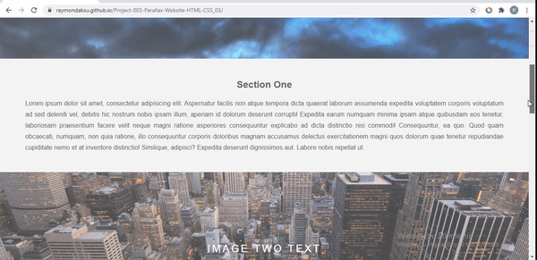    
- **Google Landing Page (HTML, CSS)**  [Repository](https://github.com/raymondaksu/Project-002-Google-Landing-Page-HTML-CSS_02) - 
  [Live demo](https://raymondaksu.github.io/Project-002-Google-Landing-Page-HTML-CSS_02/) 
  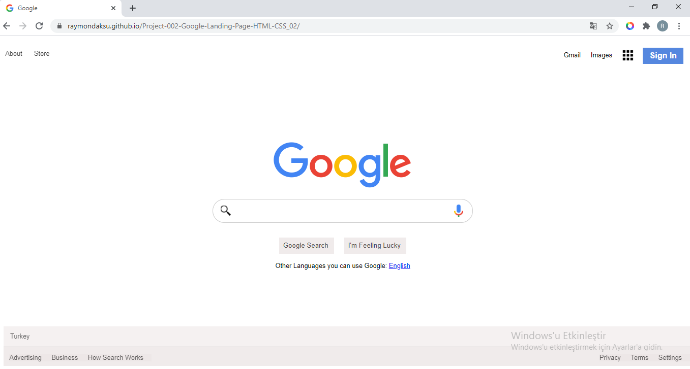    
- **Netflix Survey Form (HTML, CSS)**  [Repository](https://github.com/raymondaksu/Project-001-Netflix-SignUp-Page-HTML-CSS_01) - 
  [Live demo](https://raymondaksu.github.io/Project-001-Netflix-SignUp-Page-HTML-CSS_01/) 
  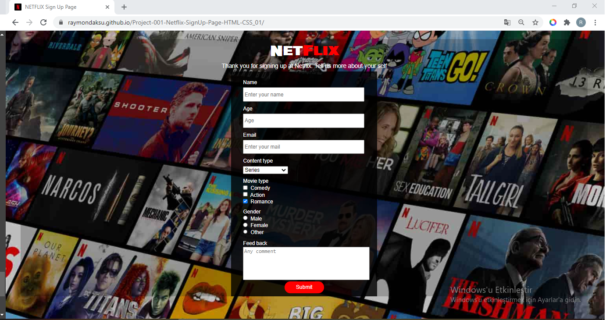     
